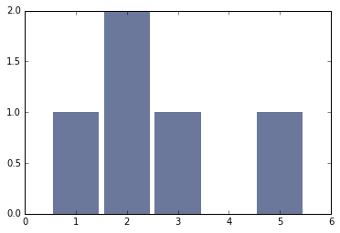
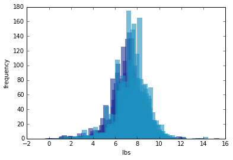

[Think Stats Chapter 2 Exercise 4](http://greenteapress.com/thinkstats2/html/thinkstats2003.html#toc24) (Cohen's d)

>> Cohen's d is -0.089 when analyzing the effect size of first babies vs others with respect to `totalwgt_lb.` This is negative and ~3 times more than the Cohen's d for pregnancy length.


```python
%matplotlib inline
```


```python
import thinkstats2
```


```python
hist = thinkstats2.Hist([1,2,2,3,5])
```


```python
hist
```


    Hist({1: 1, 2: 2, 3: 1, 5: 1})


```python
import thinkplot
```


```python
thinkplot.Hist(hist)
```





```python
import nsfg
```


```python
preg = nsfg.ReadFemPreg()
```


```python
preg.head()
```


<div>
<table border="1" class="dataframe">
  <thead>
    <tr style="text-align: right;">
      <th></th>
      <th>caseid</th>
      <th>pregordr</th>
      <th>howpreg_n</th>
      <th>howpreg_p</th>
      <th>moscurrp</th>
      <th>nowprgdk</th>
      <th>pregend1</th>
      <th>pregend2</th>
      <th>nbrnaliv</th>
      <th>multbrth</th>
      <th>...</th>
      <th>laborfor_i</th>
      <th>religion_i</th>
      <th>metro_i</th>
      <th>basewgt</th>
      <th>adj_mod_basewgt</th>
      <th>finalwgt</th>
      <th>secu_p</th>
      <th>sest</th>
      <th>cmintvw</th>
      <th>totalwgt_lb</th>
    </tr>
  </thead>
  <tbody>
    <tr>
      <th>0</th>
      <td>1</td>
      <td>1</td>
      <td>NaN</td>
      <td>NaN</td>
      <td>NaN</td>
      <td>NaN</td>
      <td>6</td>
      <td>NaN</td>
      <td>1</td>
      <td>NaN</td>
      <td>...</td>
      <td>0</td>
      <td>0</td>
      <td>0</td>
      <td>3410.389399</td>
      <td>3869.349602</td>
      <td>6448.271112</td>
      <td>2</td>
      <td>9</td>
      <td>NaN</td>
      <td>8.8125</td>
    </tr>
    <tr>
      <th>1</th>
      <td>1</td>
      <td>2</td>
      <td>NaN</td>
      <td>NaN</td>
      <td>NaN</td>
      <td>NaN</td>
      <td>6</td>
      <td>NaN</td>
      <td>1</td>
      <td>NaN</td>
      <td>...</td>
      <td>0</td>
      <td>0</td>
      <td>0</td>
      <td>3410.389399</td>
      <td>3869.349602</td>
      <td>6448.271112</td>
      <td>2</td>
      <td>9</td>
      <td>NaN</td>
      <td>7.8750</td>
    </tr>
    <tr>
      <th>2</th>
      <td>2</td>
      <td>1</td>
      <td>NaN</td>
      <td>NaN</td>
      <td>NaN</td>
      <td>NaN</td>
      <td>5</td>
      <td>NaN</td>
      <td>3</td>
      <td>5</td>
      <td>...</td>
      <td>0</td>
      <td>0</td>
      <td>0</td>
      <td>7226.301740</td>
      <td>8567.549110</td>
      <td>12999.542264</td>
      <td>2</td>
      <td>12</td>
      <td>NaN</td>
      <td>9.1250</td>
    </tr>
    <tr>
      <th>3</th>
      <td>2</td>
      <td>2</td>
      <td>NaN</td>
      <td>NaN</td>
      <td>NaN</td>
      <td>NaN</td>
      <td>6</td>
      <td>NaN</td>
      <td>1</td>
      <td>NaN</td>
      <td>...</td>
      <td>0</td>
      <td>0</td>
      <td>0</td>
      <td>7226.301740</td>
      <td>8567.549110</td>
      <td>12999.542264</td>
      <td>2</td>
      <td>12</td>
      <td>NaN</td>
      <td>7.0000</td>
    </tr>
    <tr>
      <th>4</th>
      <td>2</td>
      <td>3</td>
      <td>NaN</td>
      <td>NaN</td>
      <td>NaN</td>
      <td>NaN</td>
      <td>6</td>
      <td>NaN</td>
      <td>1</td>
      <td>NaN</td>
      <td>...</td>
      <td>0</td>
      <td>0</td>
      <td>0</td>
      <td>7226.301740</td>
      <td>8567.549110</td>
      <td>12999.542264</td>
      <td>2</td>
      <td>12</td>
      <td>NaN</td>
      <td>6.1875</td>
    </tr>
  </tbody>
</table>
<p>5 rows × 244 columns</p>
</div>


```python
live = preg[preg.outcome == 1]
```


```python
firsts = live[live.birthord == 1]
others = live[live.birthord != 1]
```


```python
#differences in the means
print firsts['totalwgt_lb'].mean() - others['totalwgt_lb'].mean()
```

    -0.124761184535


```python
d = thinkstats2.CohenEffectSize(firsts.totalwgt_lb,others.totalwgt_lb)
```


```python
print d
```

    -0.0886729270726


```python
d2 = thinkstats2.CohenEffectSize(firsts.prglngth,others.prglngth)
```


```python
print d2
```

    0.0288790446544


```python
first_hist = thinkstats2.Hist(firsts.totalwgt_lb)
other_hist = thinkstats2.Hist(others.totalwgt_lb)
```


```python
width = 0.45
```


```python
thinkplot.PrePlot(2)
thinkplot.Hist(first_hist, align='right', width=width)
thinkplot.Hist(other_hist, align='left', width=width)
thinkplot.Show(xlabel='lbs', ylabel='frequency')
```

    /opt/anaconda/lib/python2.7/site-packages/matplotlib/axes/_axes.py:519: UserWarning: No labelled objects found. Use label='...' kwarg on individual plots.
      warnings.warn("No labelled objects found. "





    <matplotlib.figure.Figure at 0x7f5972bacf50>


**Answer to Exercise 2.4:**
Cohen's d is -0.089 when analyzing the effect size of first babies vs others with respect to `totalwgt_lb.` This is negative and ~3 times more than the Cohen's d for pregnancy length.


```python

```
