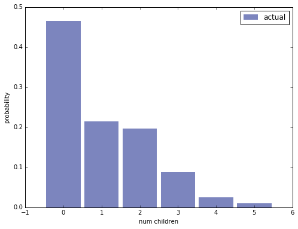
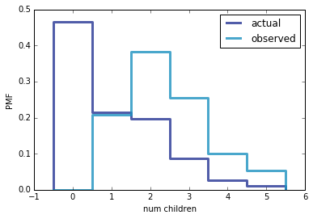

[Think Stats Chapter 3 Exercise 1](http://greenteapress.com/thinkstats2/html/thinkstats2004.html#toc31) (actual vs. biased)

>> REPLACE THIS TEXT WITH YOUR RESPONSE


```python
%matplotlib inline

import chap01soln
resp = chap01soln.ReadFemResp()

import thinkplot
```

Make a PMF of <tt>numkdhh</tt>, the number of children under 18 in the respondent's household.


```python
import thinkstats2
pmf = thinkstats2.Pmf(resp['numkdhh'], label='actual')
pmf
```


    Pmf({0: 0.46617820227659301, 1: 0.21405207379301322, 2: 0.19625801386889966, 3: 0.087138558157791451, 4: 0.025644380478869556, 5: 0.010728771424833181})


Display the PMF.


```python
thinkplot.PrePlot(1, cols=1)
thinkplot.Hist(pmf)
thinkplot.Config(xlabel='num children', ylabel='probability')
```





Define <tt>BiasPmf</tt>.


```python
def BiasPmf(pmf, label=''):
    """Returns the Pmf with oversampling proportional to value.

    If pmf is the distribution of true values, the result is the
    distribution that would be seen if values are oversampled in
    proportion to their values; for example, if you ask students
    how big their classes are, large classes are oversampled in
    proportion to their size.

    Args:
      pmf: Pmf object.
      label: string label for the new Pmf.

     Returns:
       Pmf object
    """
    new_pmf = pmf.Copy(label=label)

    for x, p in pmf.Items():
        new_pmf.Mult(x, x)

    new_pmf.Normalize()
    return new_pmf
```

Make a the biased Pmf of children in the household, as observed if you surveyed the children instead of the respondents.


```python
a = BiasPmf(pmf, label='observed')
```

Display the actual Pmf and the biased Pmf on the same axes.


```python
thinkplot.PrePlot(2)
thinkplot.Pmfs([pmf, a])
thinkplot.Show(xlabel='num children', ylabel='PMF')
```





    <matplotlib.figure.Figure at 0x7f247b95e690>


Compute the means of the two Pmfs.


```python
print('actual mean', pmf.Mean())
```

    ('actual mean', 1.0242051550438309)


```python
print('observed mean', a.Mean())
```

    ('observed mean', 2.4036791006642821)