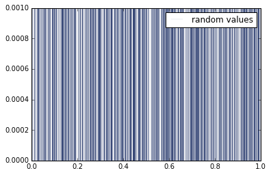
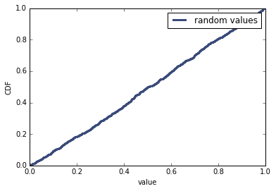

[Think Stats Chapter 4 Exercise 2](http://greenteapress.com/thinkstats2/html/thinkstats2005.html#toc41) (a random distribution)


Generate 1000 random values using <tt>random.random()</tt> and plot their PMF.


```python
import thinkstats2
import thinkplot
import random

vals = [random.random() for _ in range(1000)]
pmf = thinkstats2.Pmf(vals, label='random values')
thinkplot.Pmf(pmf, linewidth=0.1)
thinkplot.Show()
```





    <matplotlib.figure.Figure at 0x7f01c238b510>


Assuming that the PMF doesn't work very well, try plotting the CDF instead.


```python
cdf = thinkstats2.Cdf(vals, label='random values')
thinkplot.Cdf(cdf)
thinkplot.Show(xlabel='value', ylabel='CDF')
```





    <matplotlib.figure.Figure at 0x7f01bf90be10>
