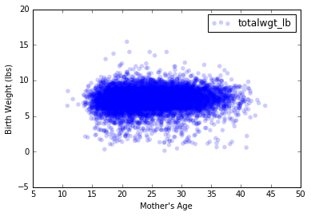
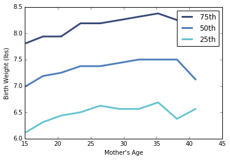

[Think Stats Chapter 7 Exercise 1](http://greenteapress.com/thinkstats2/html/thinkstats2008.html#toc70) (weight vs. age)


Using data from the NSFG, make a scatter plot of birth weight versus mother’s age. Plot percentiles of birth weight versus mother’s age. Compute Pearson’s and Spearman’s correlations. How would you characterize the relationship between these variables?


```python
import numpy as np
```


```python
import nsfg
import thinkplot
import thinkstats2
%matplotlib inline
```


```python
preg = nsfg.ReadFemPreg()
```


```python
preg.agepreg.describe()
```


    count    13241.000000
    mean        24.688151
    std          5.814708
    min         10.330000
    25%         20.080000
    50%         23.910000
    75%         28.660000
    max         44.080000
    Name: agepreg, dtype: float64


```python
preg.totalwgt_lb.describe()
```


    count    9038.000000
    mean        7.265628
    std         1.408293
    min         0.125000
    25%         6.500000
    50%         7.375000
    75%         8.125000
    max        15.437500
    Name: totalwgt_lb, dtype: float64


```python
thinkplot.Scatter(preg['agepreg'],preg['totalwgt_lb'])
thinkplot.Show(xlabel="Mother's Age",
               ylabel='Birth Weight (lbs)')
```





    <matplotlib.figure.Figure at 0x7fb6e3a57910>


```python
df = preg.dropna(subset=['totalwgt_lb', 'agepreg'])
```


```python
bins = np.arange(10, 48, 3)
indices = np.digitize(df.agepreg, bins)
groups = df.groupby(indices)

ages = [group.agepreg.mean() for i, group in groups][1:-1]
cdfs = [thinkstats2.Cdf(group.totalwgt_lb)
    for i, group in groups][1:-1]

thinkplot.PrePlot(3)
for percent in [75, 50, 25]:
    weights = [cdf.Percentile(percent) for cdf in cdfs]
    label = '%dth' % percent
    thinkplot.Plot(ages, weights, label=label)

thinkplot.Show(xlabel="Mother's Age",
               ylabel="Birth Weight (lbs)")
```





    <matplotlib.figure.Figure at 0x7fb6e37ed2d0>


```python
print("Pearson's Correlation",
      thinkstats2.Corr(df.agepreg,df.totalwgt_lb))
```

    ("Pearson's Correlation", 0.06883397035410907)


```python
print("Spearman's Correlation",
      thinkstats2.SpearmanCorr(df.agepreg,df.totalwgt_lb))
```

    ("Spearman's Correlation", 0.094610041096582262)


The relationship between the variables is weak based on the random pattern of the scatterplot and the low correlation coefficients. The percentile plot suggests a non-linear relationship based on the higher rate of change in birth weight as mother's age increases between 15-25 vs the rate of change 25+.


```python

```

