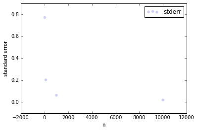

[Think Stats Chapter 8 Exercise 2](http://greenteapress.com/thinkstats2/html/thinkstats2009.html#toc77) (scoring)


Suppose you draw a sample with size n=10 from an exponential distribution with λ=2. Simulate this experiment 1000 times and plot the sampling distribution of the estimate L. Compute the standard error of the estimate and the 90% confidence interval.

Repeat the experiment with a few different values of n and make a plot of standard error versus n.


```python
import numpy as np
import math
import thinkstats2
import thinkplot
from estimation import RMSE, MeanError
%matplotlib inline
from pandas import DataFrame
```


```python
def SimulateSample(lam=2, n=10, m=1000, output=False):

    means = []
    for j in range(m):
        xs = np.random.exponential(1.0/lam, n)
        L = 1.0 / np.mean(xs)
        means.append(L)

    stderr = RMSE(means, lam)
    cdf = thinkstats2.Cdf(means, label='means')
    ci = cdf.Percentile(5), cdf.Percentile(95)

    # plot the CDF
    if output:
        print ('standard error', stderr)
        print('confidence interval', ci)
        thinkplot.Cdf(cdf)
        thinkplot.Show(xlabel='estimate',
                   ylabel='CDF',
                   title='Sampling distribution')

    return stderr
```


```python
SimulateSample(output=True)
```

    ('standard error', 0.8527379154432632)
    ('confidence interval', (1.2671833662710668, 3.6758013771152198))


    0.8527379154432632


    <matplotlib.figure.Figure at 0x7f05746a41d0>


```python
stderrs = []
for x in [10, 100, 1000, 10000]:
    stderrs.append([x, SimulateSample(n=x)])
stderrs
```


    [[10, 0.7706189830957623],
     [100, 0.2036197474182346],
     [1000, 0.06293147400987993],
     [10000, 0.020233680048643465]]


```python
df = DataFrame(stderrs, columns=['n', 'stderr'])
```


```python
thinkplot.Scatter(xs=df['n'], ys=df['stderr'])
thinkplot.Show(xlabel='n', ylabel='standard error')
```





    <matplotlib.figure.Figure at 0x7f054392a290>


