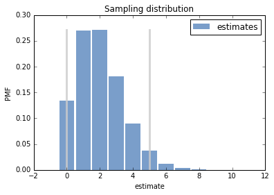

[Think Stats Chapter 8 Exercise 3](http://greenteapress.com/thinkstats2/html/thinkstats2009.html#toc77)

---


In games like hockey and soccer, the time between goals is roughly exponential. So you could estimate a team’s goal-scoring rate by observing the number of goals they score in a game. This estimation process is a little different from sampling the time between goals, so let’s see how it works.

Write a function that takes a goal-scoring rate, lam, in goals per game, and simulates a game by generating the time between goals until the total time exceeds 1 game, then returns the number of goals scored.

Write another function that simulates many games, stores the estimates of lam, then computes their mean error and RMSE.

Is this way of making an estimate biased? Plot the sampling distribution of the estimates and the 90% confidence interval. What is the standard error? What happens to sampling error for increasing values of lam?


```python
import thinkstats2
import thinkplot

import math
import random
import numpy as np

from estimation import RMSE, MeanError
%matplotlib inline

from pandas import DataFrame
```


```python
def VertLine(x, y=1):
        thinkplot.Plot([x, x], [0, y],
                       color='0.8', linewidth=3)
```


```python
def PlayGame(lam):
    goals = 0
    time = 0
    while True:
        time_bw_goals = random.expovariate(lam)
        time += time_bw_goals
        if time > 1:
            break
        goals += 1
    return goals
```


```python
def SimulateGame(lam=2, m=100000):

    estimates = []
    for _ in range(m):
        L = PlayGame(lam)
        estimates.append(L)

    print('rmse L', RMSE(estimates, lam))
    print('mean error L', MeanError(estimates, lam))

    pmf = thinkstats2.Pmf(estimates, label='estimates')

    ci = pmf.Percentile(5), pmf.Percentile(95)
    print('confidence interval', ci)
    max_val = max(pmf.Items(),key=lambda item:item[1])[1]
    print max_val

    thinkplot.Hist(pmf,align='center')
    VertLine(ci[0], max_val)
    VertLine(ci[1], max_val)
    thinkplot.Show(xlabel='estimate',
               ylabel='PMF',
               title='Sampling distribution')
```


```python
SimulateGame()
```

    ('rmse L', 1.4148462814030365)
    ('mean error L', 0.0048900000000000002)
    ('confidence interval', (0, 5))
    0.27081





    <matplotlib.figure.Figure at 0x7f9c3bfbb150>


---